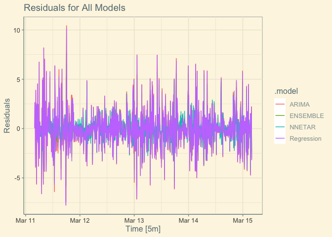
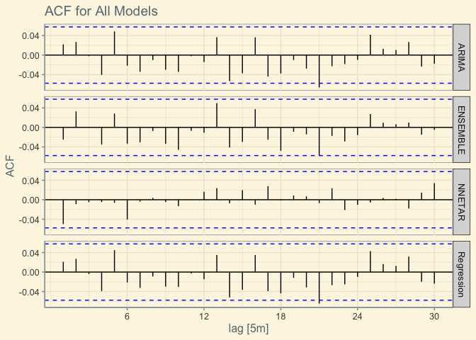
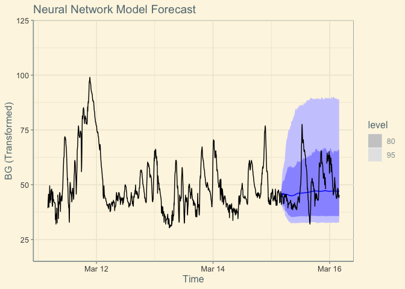

# Introduction 

In January of 2024, I was diagnosed with type-1 diabetes. As I learned about my condition and what it would demand of me on a daily basis, I quickly realized that my education in data analysis has situated me well to tackle this lifelong challenge. Given this realization, I decided to make the best of a bad situation and use my data analysis knowledge to track and analyze my diabetes. 

# An Extremely Brief Biology Lesson

Diabetes is primarily concerned with blood glucose and insulin. Cells in the body are powered by glucose (sugar), and the blood delivers this glucose to all cells. Therefore, blood glucose is a measurement of how much glucose is in the blood (measured as milligrams per deciliter in my data). Insulin is a hormone, produced by the pancreas, which removes glucose from the blood for use in the cells. 

(add diagram here)

Diabetes is a breakdown of this bodily function. Type-1 diabetes is the result of the immune system attacking the pancreas, stopping the production of insulin, sometimes completely. Type-2 diabetes is largely the result of an insulin resistance. In both cases, the body is unable to remove glucose from the blood stream for use in the cells, meaning glucose builds up in the blood, sometimes to dangerously high levels.

# Data Importation

I was diagnosed with type-1 diabetes in January of 2024, changing my
life forever….

    # Importing data 
    df.model <- read.csv("Data/df_model.csv")

##### Generating: Final Time-Series

    ts <- df.model |>
      mutate(Time = as_datetime(Time)) |>
      select(-c(X)) |>
      as_tsibble(key = BG,
                 index = Time) |>
      arrange(Time)

# Model Preperation

### Box-Cox Transformation

Before we can build our models, we need to ensure the time-series is
ready. After testing multiple transformations, I found the Box-Cox to be
optimal.

    lambda <- BoxCox.lambda(ts$BG, method = c("guerrero"))
    ts$BG <- ts$BG^lambda
    transformed.ts <- as_tsibble(ts, index = Time)

    # Unit root test
    transformed.ts |> features(BG, unitroot_kpss)

    ## # A tibble: 1 × 2
    ##   kpss_stat kpss_pvalue
    ##       <dbl>       <dbl>
    ## 1      2.79        0.01

does not pass kpss. is not stationary.

### Train & Test Sets

In order to assess the accuracy of our models, we will need to split our
data in to ‘train’ and ‘test’ data sets. The first four years of the
data (80%), 2017-2020, will be put in the train set, and the final year
(20%), 2021, will be put in the test data set.

    # Train
    train <- transformed.ts |>
      filter(Time >= "2024-03-11 00:00:00",
             Time < "2024-03-15 00:00:00") |>
      fill_gaps() |> 
      arrange(Time)

    # Test
    test <- transformed.ts |>
      filter(Time >= "2024-03-15 00:00:00",
             Time < "2024-03-16 00:00:00") |>
      fill_gaps() |>
      arrange(Time)

# Model Generation

Now we will create our forecasting models using the training data set.
The first model will be a linear regression model, using the predictor
variables previously discussed, and trend and seasonal components. The
second model will be an optimized ETS. The third model will be an
optimized ARIMA. The final model will be an aggregation of all three
previous models.

    fit <- train |> model(
      ARIMA = ARIMA(BG),  
      Regression = ARIMA(BG ~ EffectiveCarbs + EffectiveInsulin + as.factor(Exercise)),
      NNETAR = NNETAR(BG)) |>
      mutate(ENSEMBLE = (Regression + ARIMA + NNETAR)/3)
    fit

    ## # A mable: 1 x 4
    ##                       ARIMA                             Regression
    ##                     <model>                                <model>
    ## 1 <ARIMA(3,1,0)(2,0,0)[12]> <LM w/ ARIMA(3,1,0)(2,0,0)[12] errors>
    ## # ℹ 2 more variables: NNETAR <model>, ENSEMBLE <model>

The ETS and ARIMA models were automatically optimized. The ETS model has
multiplicative error and season components, and an additive trend
component. The ARIMA is seasonally and non-seasonally differenced, and
has a first order moving average component \[MA(q=1)\].

# Residual Analysis

Before we can forecast with these models, we need to analyze their
residuals.

    # Residuals Plot
    augment(fit) |>
      autoplot(.resid) +
      labs(title = "Residuals for All Models",
           y = "Residuals")

    ## Warning: Removed 52 rows containing missing values (`geom_line()`).

    # ACF Plots
    augment(fit) |>
      ACF(.resid) |>
      autoplot() +
      labs(title = "ACF for All Models",
           y = "ACF")

    # Portmanteau Test (Ljung-Box Test)
    augment(fit) |>
      features(.resid, ljung_box, lag = 24) |>
      arrange(lb_pvalue)

    ## # A tibble: 4 × 3
    ##   .model     lb_stat lb_pvalue
    ##   <chr>        <dbl>     <dbl>
    ## 1 ARIMA        25.4      0.384
    ## 2 ENSEMBLE     25.2      0.396
    ## 3 Regression   24.9      0.412
    ## 4 NNETAR        7.63     0.999

As we can see, the residuals are relatively normally distributed around
the mean of zero, meaning they are homoscedastic. The ACF plots for the
ETS and ARIMA models look good, as does the ENSEMBLE model. The ACF plot
for the regression model is slightly concerning. Furthermore, while the
ETS and ARIMA models pass the Ljung-Box test, the regression model does
not. While normally, these two facts would disqualify this model, we
will proceed with this model for the sake of this exercise. As we will
see when we forecast with these models, it performs well despite these
concerns.

# Forecast

### Neural Network Forecast

    # Generating forecast plot
    fit |> select(c(NNETAR)) |> forecast(new_data = test) |> autoplot(train) +
      ylim(c(20, 120)) +
      autolayer(test) +
      labs(title = "Neural Network Model Forecast",
           x = "Time",
           y = "BG (Transformed)") 

    ## Plot variable not specified, automatically selected `.vars = BG`

 \#
Accuracy

To assess the accuracy of our forecast models more specifically, we need
to compare the generated forecasts against the test data with the
following metrics:

### Point Forecast Accuracy

    # Generating the forecast table (fable)
    myf <- fit |> select(c(NNETAR)) |> forecast(new_data = test)

    # Generating a point forecast accuracy table
    accuracy(myf, test) |>
      mutate(Model = .model) |>
      select(c(Model, MAE, RMSE, MAPE)) |>
      arrange(MAPE)

    ## # A tibble: 1 × 4
    ##   Model    MAE  RMSE  MAPE
    ##   <chr>  <dbl> <dbl> <dbl>
    ## 1 NNETAR  6.84  9.35  12.8

All of our models perform well, with the regression model performing
slightly worse. The ENSEMBLE model is slightly better than the ETS and
ARIMA models.

### Prediction Interval Accuracy

    myf |> accuracy(test, list(crps =CRPS)) |>
      mutate(Model = .model,
             CRPS = crps) |>
      select(c(Model, CRPS)) |>
      arrange(CRPS)

    ## # A tibble: 1 × 2
    ##   Model   CRPS
    ##   <chr>  <dbl>
    ## 1 NNETAR  5.59

Again ENSEMBLE model outperforms the others, but all models perform
relatively well.

