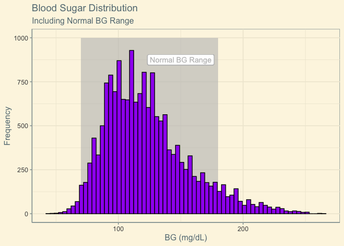
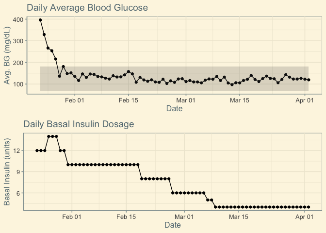
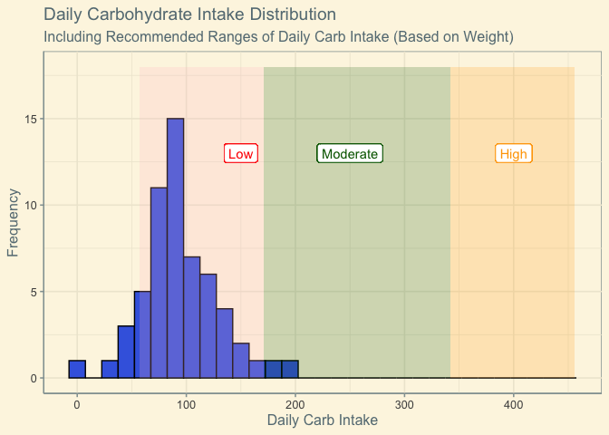
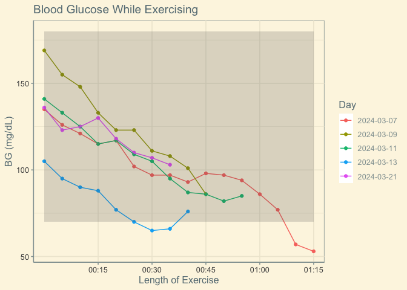
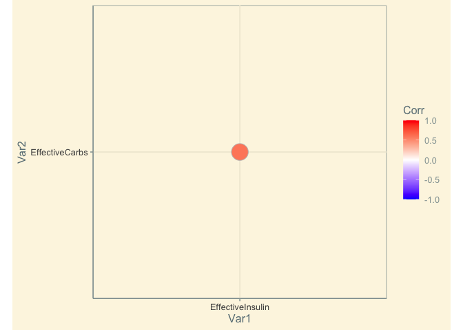
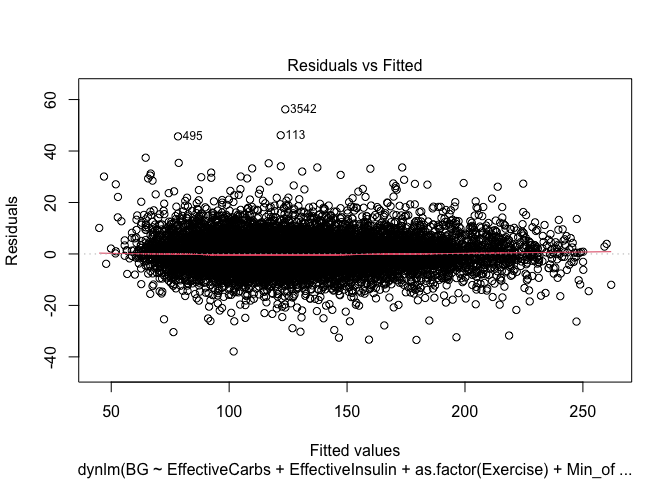
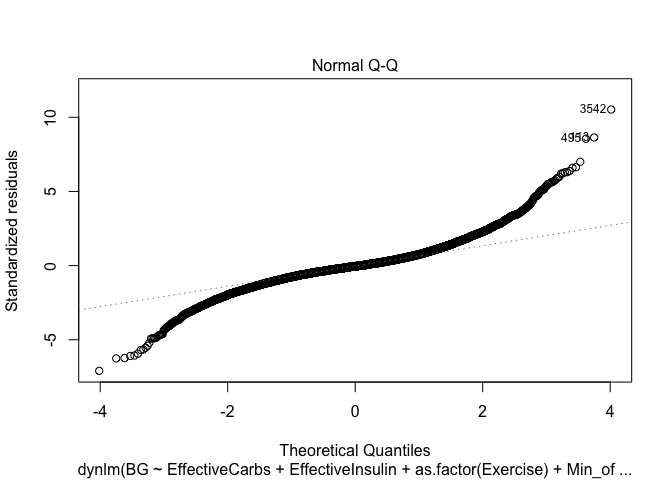
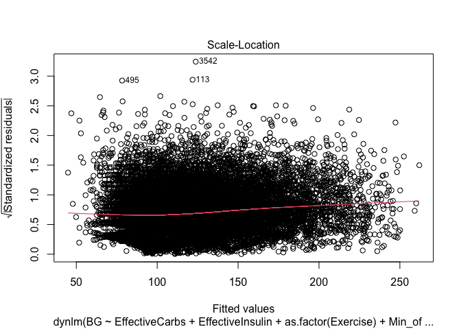
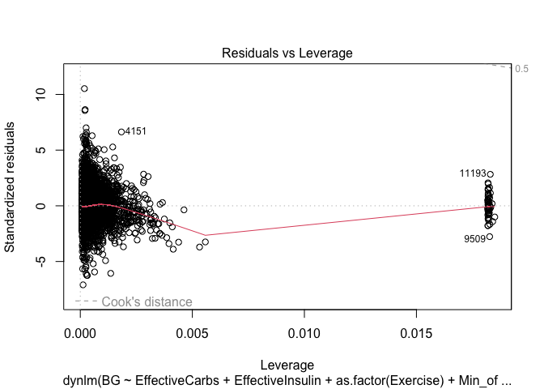

# Data Importation

    # Importing data 
    df <- read.csv("Data/df_model.csv")
    df.old <- read.csv("Data/old_BG.csv")
    df.basal <- read.csv("Data/basal_data.csv")
    df.carbs <- read.csv("Data/carbs_data.csv")

# Visualization

## Blood Glucose

    # Calculate optimal binwidth using the Freedman-Diaconis rule
    bw <- 2 * IQR(df$BG) / length(df$BG)^(1/3)

    # Distribution of blood sugar
    ggplot(df, aes(x = BG)) +
      annotate("rect", fill = "gray",
               xmin = 70, xmax = 180, ymin = 0, ymax = 1000, alpha = .6) +
      geom_label(aes(x = 150, y = 875, label = "Normal BG Range"), 
                 color = "gray", fill = "white", alpha = 0.6) +
      geom_histogram(color = "black", fill = "purple", binwidth = bw) +
      labs(title = "Blood Sugar Distribution",
           subtitle = "Including Normal BG Range",
           x = "BG (mg/dL)",
           y = "Frequency") 

    # Percent in-range
    round(100*(sum(df$BG >= 70 & df$BG <= 180)/nrow(df)), 2)

    ## [1] 91.69

    # Summary statistics
    df |> summarise(BG.mean = mean(BG),
                    BG.sd = sd(BG),
                    BG.var = var(BG))

    ##    BG.mean    BG.sd  BG.var
    ## 1 123.1527 33.57915 1127.56

## Insulin: “Honeymoon Phase”

    # Calculating average BG every day from CGM data
    df.avgBG <- df |>
      mutate(Date = as_date(Time),
             Time = floor_date(Date)) |>
      group_by(Date) |>
      summarize(avgBG = mean(BG))

    # Cleaning old handwritten BG data (prior to CGM)
    df.old <- df.old |>
      mutate(Date = as_date(Date)) |>
      select(Date, avgBG) |>
      arrange(Date)

    # Aggregating all average BG data
    df.avgBG <- rbind(df.old, df.avgBG)

    # Combing average BG with basal
    df.basal <- df.basal |>
      mutate(Date = as.Date(Date, "%m/%d/%Y"),
             TimeofDay = format(as.POSIXct(Time,format='%I:%M:%S %p'),format="%H:%M:%S"),
             Time = ymd_hms(paste(Date, TimeofDay)),
             Time = format(as.POSIXct(Time, tz = "UTC"), "%Y-%m-%d %H:%M:%S"),
             Basal = as.numeric(Basal)) |>
      select(Time, Basal)
    df.basal <- cbind(df.avgBG, df.basal) |>
      select(Date, Basal, avgBG)

    # Generating new time-series to plot
    ts.honeymoon <- df.basal |>
      as_tsibble(index = Date)

    # Plotting average BG  
    xmin = df.basal$Date[1]
    xmax = df.basal$Date[nrow(df.basal)]
    gg.avgBG <- ggplot(ts.honeymoon, aes(x = Date, avgBG)) +  
      geom_point(aes(y = avgBG)) +
      geom_line(aes(y = avgBG)) +
      labs(title = "Daily Average Blood Glucose",
           x = "Date",
           y = "Avg. BG (mg/dL)") +
      annotate("rect", xmin = xmin, xmax = xmax, ymin = 70, ymax = 180, 
               alpha = .2)

    # Plotting basal units
    gg.basal <- ggplot(ts.honeymoon, aes(x = Date, Basal)) +  
      geom_point(aes(y = Basal)) +
      geom_line(aes(y = Basal)) +
      labs(title = "Daily Basal Insulin Dosage",
           x = "Date",
           y = "Basal Insulin (units)")

    # Combining into one plot
    ggarrange(gg.avgBG, gg.basal, ncol = 1, nrow = 2) 

## Carbs: Daily Intake

    # Cleaning carbs data
    df.carbs <- df.carbs |> 
      mutate(Date = as.Date(Date, "%m/%d/%y"),
             TimeofDay = format(as.POSIXct(Time.of.Day,format='%I:%M:%S %p'),format="%H:%M:%S"),
             Time = ymd_hms(paste(Date, TimeofDay)),
             Carbs = as.numeric(Carbs..grams..est..),
             Bolus = as.numeric(Bolus..units.)) |>
      select(Time, Carbs, Bolus, Food)

    # Calculating daily carb intake
    df.daily.carbs <- df.carbs |>
      mutate(Date = as_date(Time),
             Time = floor_date(Date)) |>
      group_by(Date) |>
      summarize(DailyCarbs = sum(Carbs))

    # Generating new time-series to plot
    ts.daily.carbs <- df.daily.carbs |>
      as_tsibble(index = Date)

    # Plotting daily carbs
    kgs <- 57
    lowmin <- 1*kgs
    lowmax <- 3*kgs
    midmax <- 6*kgs
    highmax <- 8*kgs
    ggplot(ts.daily.carbs, aes(x = DailyCarbs)) +  
      geom_histogram(color = "black", fill = "royalblue", binwidth = 15) +
      labs(title = "Daily Carbohydrate Intake Distribution",
           subtitle = "Including Recommended Ranges of Daily Carb Intake (Based on Weight)",
           x = "Daily Carb Intake",
           y = "Frequency") +
      annotate("rect", fill = "pink",
               xmin = lowmin, xmax = lowmax, ymin = 0, ymax = 18, alpha = .2) +
      annotate("rect", fill = "darkgreen",
               xmin = lowmax, xmax = midmax, ymin = 0, ymax = 18, alpha = .2) +
      annotate("rect", fill = "orange",
               xmin = midmax, xmax = highmax, ymin = 0, ymax = 18, alpha = .2) +
      geom_label(aes(x = 150, y = 13, label = "Low"), color = "red", fill = "white") + 
      geom_label(aes(x = 250, y = 13, label = "Moderate"), color = "darkgreen", fill = "white") +
      geom_label(aes(x = 400, y = 13, label = "High"), color = "orange", fill = "white")  

## Exercise: Effect on BG

    # BG during exercise
    df.bg_during_exercise <- df |>
      filter(Exercise == 1) |>
      mutate(Day = as_date(Time),
             Hour = hour(Time),
             Minute = minute(Time),
             TimeSpent = paste(Hour, Minute, sep = ":")) |>
      group_by(Day) |>
      select(BG, Day, TimeSpent)

    # Manipulating the time to "time from start of workout"
    time_vector <- format(seq.POSIXt(as.POSIXct(Sys.Date()), 
                                     as.POSIXct(Sys.Date()+1), 
                                     by = "5 min"), 
                          "%H:%M", tz="UTC")
    df.bg_during_exercise$TimeSpent[1:16] <- time_vector[1:16]
    df.bg_during_exercise$TimeSpent[17:26] <- time_vector[1:10]
    df.bg_during_exercise$TimeSpent[27:38] <- time_vector[1:12]
    df.bg_during_exercise$TimeSpent[39:47] <- time_vector[1:9]
    df.bg_during_exercise$TimeSpent[48:55] <- time_vector[1:8]
    df.bg_during_exercise$TimeSpent.num <- as.numeric(hm(df.bg_during_exercise$TimeSpent),
                                                      "minutes")

    # Plotting 
    xmin <- df.bg_during_exercise$TimeSpent[1]
    xmax <- df.bg_during_exercise$TimeSpent[16]
    df.bg_during_exercise |>
      ggplot(aes(x=TimeSpent, y = BG, group = Day, color = Day)) +
      geom_point(aes(y = BG, color = factor(Day))) +
      geom_line(aes(y = BG, color = factor(Day))) +
      labs(title = "Blood Glucose While Exercising",
           x = "Length of Exercise",
           y = "BG (mg/dL)") +
      annotate("rect", xmin = xmin, xmax = xmax, ymin = 70, ymax = 180, 
               alpha = .2) +
      scale_x_discrete(breaks=c("00:15","00:30","00:45","01:00","01:15"),
                       labels=c("00:15","00:30","00:45","01:00","01:15"))

# Regression Analysis

#### Data Preperation

    # Creating numeric variable for minute of the day
    df.regression <- df |>
      mutate(BG = as.numeric(BG),
             Hour = hour(Time),
             Minute = minute(Time))
    df.regression$Min_of_day <- ((df.regression$Hour*60) + df.regression$Minute)

    # Adding lagged BG value
    df.regression$BG_L1 <- lag(df.regression$BG)

#### Correlations

    # Create data frame to check correlations
    df.cor <- df |>
      select(-c(X,BG,Time,Exercise))

    # Creating correlation plot
    cor.mx <- cor(df.cor)
    ggcorrplot(cor.mx, method = "circle", hc.order = TRUE, type = "lower") + 
      theme_solarized() + 
      labs(Title = "Correlation of Numeric Variables")

\#### Model Generation

    ####
    # Multivariate, lagged regression model
    lm.model <- dynlm(BG ~ EffectiveCarbs + EffectiveInsulin + 
                        as.factor(Exercise) + Min_of_day + 
                        BG_L1,
                      data = df.regression)

#### Model Performance and Residual Analysis

    # Model Performance
    summary(lm.model)

    ## 
    ## Time series regression with "numeric" data:
    ## Start = 1, End = 16897
    ## 
    ## Call:
    ## dynlm(formula = BG ~ EffectiveCarbs + EffectiveInsulin + as.factor(Exercise) + 
    ##     Min_of_day + BG_L1, data = df.regression)
    ## 
    ## Residuals:
    ##     Min      1Q  Median      3Q     Max 
    ## -37.901  -2.608  -0.223   2.326  56.202 
    ## 
    ## Coefficients:
    ##                        Estimate Std. Error t value             Pr(>|t|)    
    ## (Intercept)           1.6646269  0.1620044  10.275 < 0.0000000000000002 ***
    ## EffectiveCarbs        0.0672558  0.0053808  12.499 < 0.0000000000000002 ***
    ## EffectiveInsulin     -0.3079071  0.1326885  -2.321             0.020324 *  
    ## as.factor(Exercise)1 -6.3220208  0.7224871  -8.750 < 0.0000000000000002 ***
    ## Min_of_day            0.0003775  0.0001058   3.567             0.000362 ***
    ## BG_L1                 0.9817726  0.0012850 763.997 < 0.0000000000000002 ***
    ## ---
    ## Signif. codes:  0 '***' 0.001 '**' 0.01 '*' 0.05 '.' 0.1 ' ' 1
    ## 
    ## Residual standard error: 5.341 on 16891 degrees of freedom
    ##   (1 observation deleted due to missingness)
    ## Multiple R-squared:  0.9747, Adjusted R-squared:  0.9747 
    ## F-statistic: 1.302e+05 on 5 and 16891 DF,  p-value: < 0.00000000000000022

    # Residual Analysis
    plot(lm.model)

